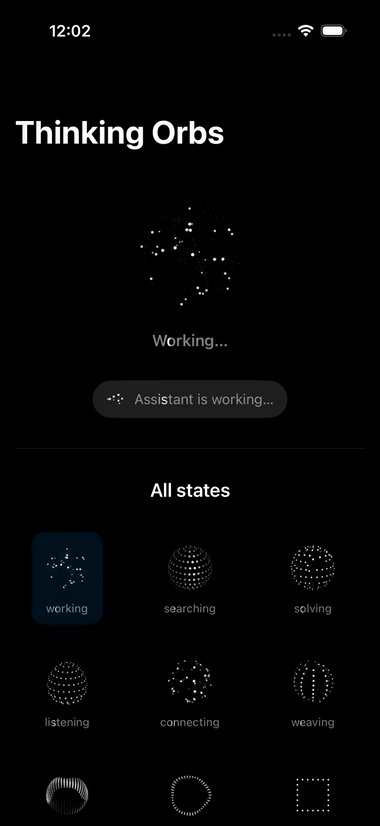

# Thinking Orbs

A faithful Swift / SwiftUI port of [`thinking-orbs`](https://github.com/Jakubantalik/thinking-orbs) — a set of nine honestly-3D, point-cloud "thinking" orbs for AI assistants, plus the shimmering labels that go with them.

<p align="center">
  
</p>

<p align="center"><em>Dark mode. Every orb animates continuously; labels carry a left→right light sweep every 2 s.</em></p>

> 📹 Higher-quality H.264 clip: [`docs/demo.mp4`](docs/demo.mp4) · single poster frame: [`docs/demo.png`](docs/demo.png)
>
> *(GitHub's README sanitizer strips `<video>` tags whose `src` is a relative path, so the animated preview is a GIF; click the mp4 link for full-resolution playback.)*

## What's inside

- **Nine states → nine modes.** Each "thinking" state maps to a distinct 3D animation, rendered as a depth-shaded point cloud (no flat sprites):
- **Shimmer labels.** A Swift port of the reference demo's `t-shimmer` (transitions.dev): calm dim base text with a soft bright band that sweeps across the glyphs every 2 s. Ink mirrors for dark (`white 50%` base / `#fff` highlight) and light (`black 45%` base / `#0d0d0d` highlight) themes.
- **One shared clock.** Every mounted orb ticks in phase, mirroring the JS shared-clock design, with a small elapsed `t` to avoid float precision loss.
- **Accessibility first.** `accessibilityReduceMotion` freezes each orb on a single deterministic frame and disables the shimmer sweep — the UI is still legible, just still.
- **Theme-aware.** `.auto` (follows environment), `.dark`, or `.light`.

| State | Mode | |
|---|---|---|
| `working` | orbits | orbiting particles + ghost sphere |
| `searching` | globe | lat/long globe with a roaming scan |
| `solving` | rubik | rotating cube with slice moves |
| `listening` | wave | undulating concentric rings |
| `connecting` | web | node graph with travelling signals |
| `weaving` | braid | interlocking helical strands |
| `composing` | ribbon | undulating ribbon band |
| `breathing` | ring | face-on pulsing ring |
| `shaping` | morph | icon morphing through an outline |

## Build & run

Requires Xcode 15+ and the iOS 16+ SDK.

```bash
# build
xcodebuild -project ThinkingOrbsDemo.xcodeproj \
           -scheme ThinkingOrbsDemo \
           -configuration Debug \
           -sdk iphonesimulator build

# run in a booted simulator
xcrun simctl boot 'iPhone 17' 2>/dev/null
open -a Simulator
APP=$(find ~/Library/Developer/Xcode/DerivedData \
      -path '*Debug-iphonesimulator/ThinkingOrbsDemo.app' -name 'ThinkingOrbsDemo.app' | head -1)
xcrun simctl install booted "$APP"
xcrun simctl launch booted com.example.ThinkingOrbsDemo
```

Or just open `ThinkingOrbsDemo.xcodeproj` in Xcode and press ▶.

The demo (`DemoView`) has a playground at the bottom: preview size (64 avatar / 20 inline), speed multiplier, pause, and force-dark-theme toggles.

## Use the component

```swift
import SwiftUI
// ThinkingOrb and ShimmerText live in this target.

// A 64-pt avatar orb (default size)
ThinkingOrb(state: .searching, size: 64)

// A 20-pt inline orb for chat bubbles, with a shimmering caption
HStack(spacing: 8) {
    ThinkingOrb(state: .working, size: 20)
    ShimmerText(text: "Assistant is working…", font: .subheadline)
}
```

## Project structure

```
ThinkingOrbsDemo/
├── ThinkingOrb.swift     # ThinkingOrb view, OrbTheme, ShimmerText
├── OrbEngine.swift       # the 9 painters + orbDrawMode dispatch
├── OrbProfiles.swift     # density profiles, the 9 presets, state→mode
├── OrbCore.swift         # dot/line/projector primitives, noise, hash
├── DemoView.swift        # gallery + playground
└── ThinkingOrbsDemoApp.swift
docs/
├── demo.gif              # animated preview (shown above)
├── demo.mp4              # higher-quality H.264 clip
└── demo.png              # single poster frame
```

## Credits

Original concept, design, and engine by [Jakub Antalík](https://github.com/Jakubantalik) — [`thinking-orbs`](https://github.com/Jakubantalik/thinking-orbs). This project is an independent Swift/SwiftUI port for iOS; all animation parameters, modes, and presets are reproduced from the original.
