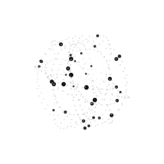
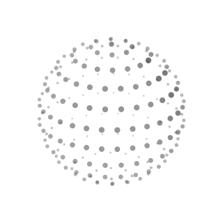
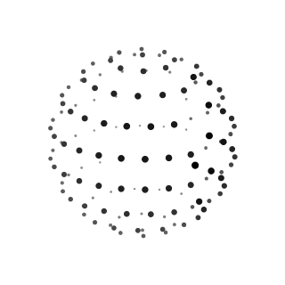
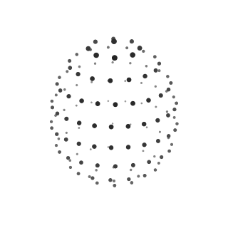
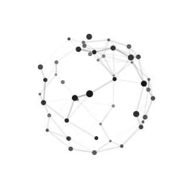
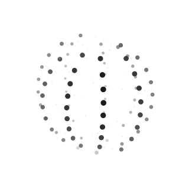
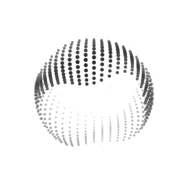
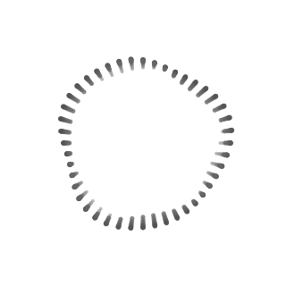
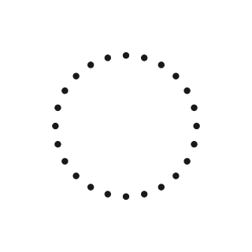

# thinking-orbs-swift

A SwiftUI port of [Jakub Antalik's **thinking-orbs**](https://github.com/Jakubantalik/thinking-orbs) — dotted "thought orb" progress indicators for AI and agent UIs. Nine hand-tuned animated states, two tuned size presets, automatic dark/light ink, zero dependencies.

Live demo of the original (the port is frame-faithful): **[orbs.jakubantalik.com](https://orbs.jakubantalik.com/)**

| | | |
| :---: | :---: | :---: |
|  |  |  |
| `working` | `searching` | `solving` |
|  |  |  |
| `listening` | `connecting` | `weaving` |
|  |  |  |
| `composing` | `breathing` | `shaping` |

*(Static frames — see the [demo](https://orbs.jakubantalik.com/) for motion.)*

## Install

```swift
dependencies: [
    .package(url: "https://github.com/ripulio/thinking-orbs-swift.git", from: "0.1.0")
]
```

Requires iOS 17 / macOS 14 (SwiftUI `Canvas` + `TimelineView`).

## Usage

```swift
import ThinkingOrbs

ThinkingOrbView(state: .working)                   // 64pt chat-avatar scale
ThinkingOrbView(state: .listening, size: .inline)  // 20pt inline-text scale
ThinkingOrbView(state: .connecting, speed: 1.5, paused: false)
```

### States

| State | Animation |
| --- | --- |
| `.working` | Particles on tilted orbits |
| `.searching` | A scan meridian sweeps a dotted globe |
| `.solving` | Bands scramble in quarter turns, then click back solved |
| `.listening` | A waveform rolls through latitude rings |
| `.connecting` | A constellation wires itself, packets running the edges |
| `.weaving` | Three strands plait around the sphere |
| `.composing` | An undulating multi-band sash |
| `.breathing` | A face-on ring slowly morphing |
| `.shaping` | A dotted outline morphs circle → triangle → square |

### API

```swift
ThinkingOrbView(
    state: OrbState = .working,
    size: OrbSizePreset = .avatar,   // .avatar (64pt) or .inline (20pt)
    theme: OrbTheme = .auto,         // .auto follows colorScheme; .dark/.light pin the ink
    speed: Double = 1,               // multiplier over the preset's baked speed
    paused: Bool = false,
    renderSize: Double? = nil        // draw a preset's tuning at a custom point size
)
```

The two size presets are **separate hand-tuned designs**, not a scale factor — each carries its own dot count, dot size and speed tuning, matching the upstream library.

### Behaviour notes

- **Honestly 3D** — rotated, depth-shaded, z-sorted; depth is carried by dot size and ink weight alone. Plain fills, no blurs or filters.
- **Pure function of time** — no simulation state; every frame derives deterministically from a shared clock, so all mounted orbs render in phase and pause/resume is trivially correct.
- **Dark/light ink** — on dark substrates the ink value is mirrored so near dots read bright: the same depth language on an inverted substrate.
- **Reduced motion** — when `accessibilityReduceMotion` is set, a static representative frame is rendered instead (matching the upstream `prefers-reduced-motion` behaviour).
- **Accessibility** — each state carries its upstream label ("Working…", "Thinking…", …) as the accessibility label.

## Development

Regenerate the reference frames (one PNG per state, for eyeballing against the demo):

```bash
THINKING_ORBS_DUMP=/tmp/orb-frames swift test --filter testDumpFrames
```

## Credits & license

Original design and implementation: [Jakub Antalik](https://github.com/Jakubantalik) — [thinking-orbs](https://github.com/Jakubantalik/thinking-orbs) (MIT). This package is a line-faithful Swift/SwiftUI port: same states, same tuned presets, same deterministic hash/noise math.

MIT — see [LICENSE](LICENSE).
