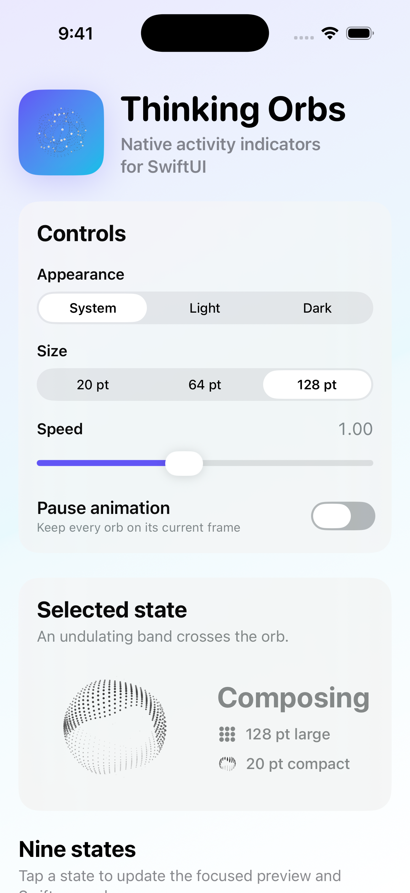
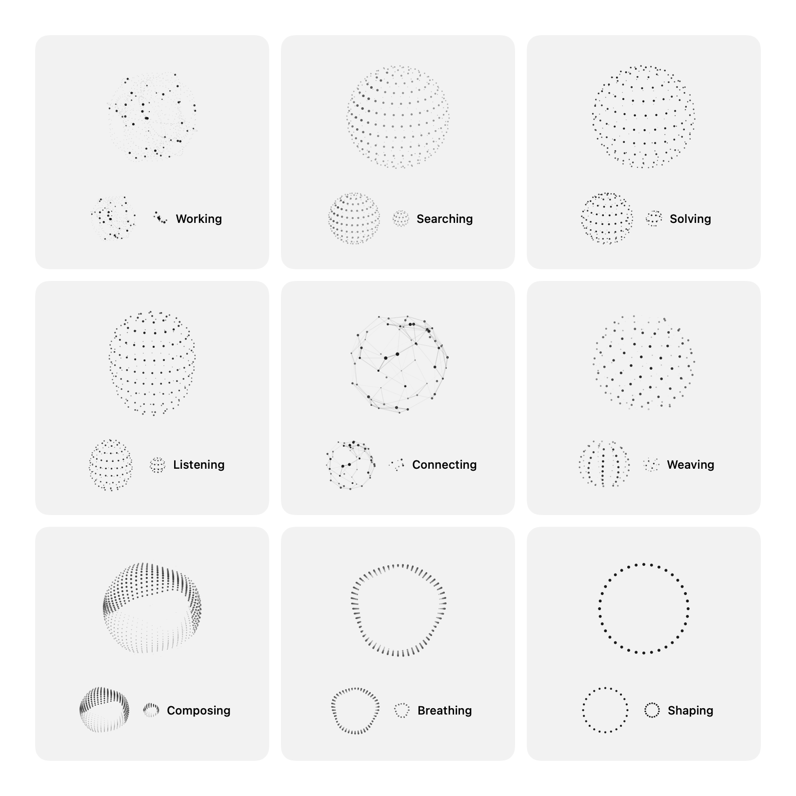
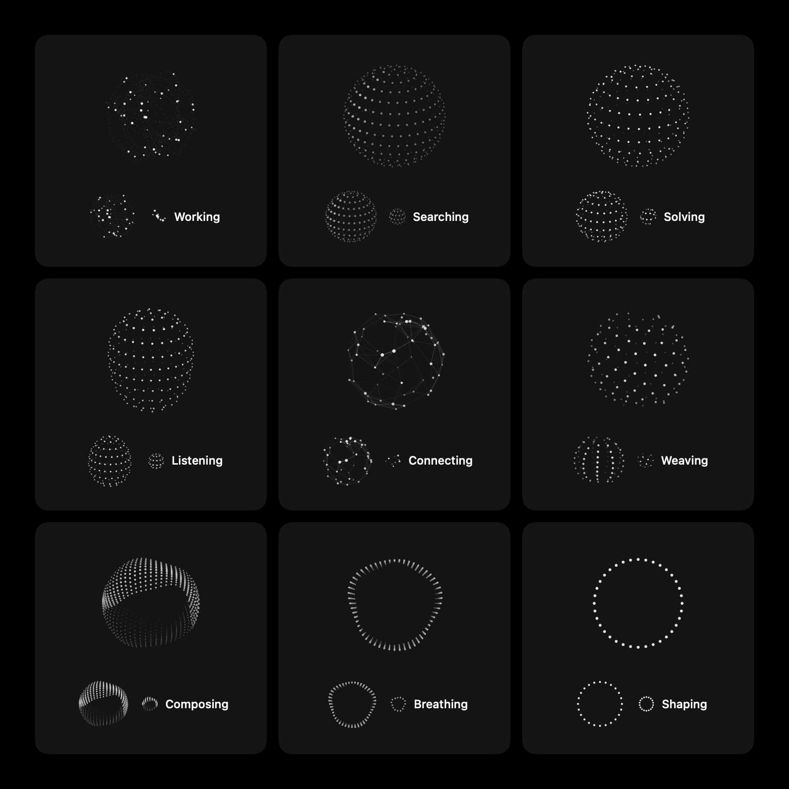

# ThinkingOrbs

ThinkingOrbs is a native Swift package for dotted, animated activity indicators
in AI and agent interfaces. It includes nine purpose-tuned states at compact,
regular, and large sizes, automatic light and dark appearance, reduced-motion
behavior, and accessible labels.

The package is an independent, attributed Swift implementation of
[thinking-orbs by Jakub Antalik](https://github.com/Jakubantalik/thinking-orbs).
It uses SwiftUI `Canvas` and plain Swift geometry. It does not use JavaScript,
WebView, WebGL, Metal shaders, image assets, or runtime dependencies.

<p align="center">
  
</p>

## Requirements

- Swift tools 6.1 or newer
- macOS 13+, iOS 16+, tvOS 16+, or visionOS 1+

## Installation

In Xcode, select **File > Add Package Dependencies** and enter:

```text
https://github.com/MichaelWDanko/thinking-orbs-swift.git
```

For a `Package.swift` dependency that tracks the current development branch:

```swift
.package(
    url: "https://github.com/MichaelWDanko/thinking-orbs-swift.git",
    branch: "main"
)
```

## API

```swift
import ThinkingOrbs
import SwiftUI

ThinkingOrb(state: .searching)
ThinkingOrb(state: .working, size: .compact)
ThinkingOrb(state: .searching, size: .large)
ThinkingOrb(state: .solving, speed: 1.5)
ThinkingOrb(state: .listening, paused: true)
ThinkingOrb(state: .connecting, theme: .dark)
```

The public states are `working`, `searching`, `solving`, `listening`,
`connecting`, `weaving`, `composing`, `breathing`, and `shaping`.

The three sizes are separate designs rather than scaled copies:

- `compact` is tuned for a 20-point inline indicator.
- `regular` is tuned for a 64-point avatar or status indicator.
- `large` is tuned for a 128-point desktop focal indicator.

### Large orb gallery

Every large orb has purpose-tuned geometry and density for desktop surfaces.

| Light appearance | Dark appearance |
| --- | --- |
|  |  |

Use the `speed` multiplier to adjust a state's tuned animation rate. Set
`paused` to stop frame updates. The default `automatic` theme follows the
SwiftUI color-scheme environment. Use `light` or `dark` when the surrounding
surface does not match that environment.

## Accessibility and lifecycle

Each state has a default accessibility label. Provide `accessibilityLabel` when
the surrounding interface needs more specific text. The orb becomes a static,
representative frame when Reduce Motion is enabled. Animation also pauses while
the containing scene is inactive.

The visual must reinforce an accessible status description. It must not be the
only indication of progress or state.

## Sound and haptic feedback

ThinkingOrbs intentionally does not play sounds or haptics. An orb represents an
ongoing state, while feedback is most useful for a discrete event. The host app
owns those events and the person's feedback preferences.

If an app also uses CuePulse, trigger it when a meaningful transition is
confirmed, such as work starting, a connection completing, or an operation
failing. Do not trigger feedback on every animation cycle, render, or incidental
background state change.

```swift
ThinkingOrb(state: model.orbState)
    .onChange(of: model.status) { _, status in
        if status == .complete {
            CuePulse.play(.ready, haptic: true)
        }
    }
```

The example requires the host app to import and configure CuePulse separately.
ThinkingOrbs does not depend on it.

## Architecture

`OrbPreset` preserves the upstream density, radius, speed, and mode tuning for
each state and size. `OrbEngine` produces deterministic dots and lines from a
preset and timestamp. `OrbCanvasRenderer` translates that geometry to a SwiftUI
`GraphicsContext`. `ThinkingOrb` owns the SwiftUI timeline, environment,
lifecycle, and accessibility behavior.

The renderer creates a 3D impression with rotation, orthographic projection,
depth-dependent size and ink, opacity, and back-to-front sorting. It remains a
2D renderer and does not require Metal.

## Example and development

Run the macOS gallery:

```sh
swift run ThinkingOrbsExample
```

Build and test the package:

```sh
swift build
swift test
swift build --product ThinkingOrbsExample
```

The standalone iOS demo is in `Demo`. Open
`Demo/ThinkingOrbsDemo.xcodeproj`, or regenerate it with XcodeGen:

```sh
cd Demo
xcodegen generate
```

Tests cover every state and size, finite geometry, deterministic output,
renderer mapping, and separate density tuning for all three sizes.

## Attribution and license

The original visual design, activity states, geometry, animation formulas,
presets, and TypeScript implementation are copyright © 2026 Jakub Antalik.
The independent Swift implementation is copyright © 2026 Michael Danko.
Both are distributed under the MIT License. See `LICENSE` and `NOTICE.md`.
